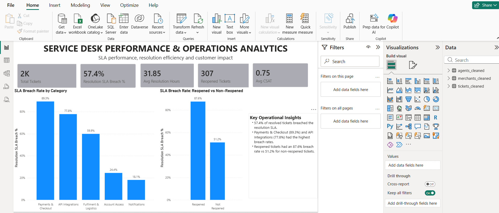

# IT Service Desk Performance & Operations Analytics

### 🛠️ Tech Stack

**Python (Pandas) • MySQL • Power BI (DAX)**

> Where does service-desk SLA performance break down, and what should an operations team investigate first?

---
## Snapshot

| Tickets analyzed | Resolution SLA breach | Highest category breach | Reopened-ticket breach |
|:---:|:---:|:---:|:---:|
| **2,057** | **57.4%** | **89.3%** (Payments & Checkout) | **87.6%** |

- **Highest-breach categories:** Payments & Checkout (89.3%) and API Integrations (77.8%)
- **Reopened vs non-reopened tickets:** 87.6% vs 51.2% breach rate



---

## Overview

I analyzed **2,057 service-desk tickets** to find where resolution SLA breaches concentrate and which operational patterns deserve attention first.

The project deliberately separates **analysis from visualization**. I investigated the data broadly in Python and SQL, then put only the most decision-relevant findings on a single, focused Power BI page.

**Questions answered**
1. Where are resolution SLA breaches concentrated?
2. Which categories face the most operational pressure?
3. Are reopened tickets associated with worse SLA performance?
4. What other patterns could guide investigation?

---

## Dataset

Public, synthetic IT service management dataset.

| Table | Records |
|---|---:|
| Tickets | 2,057 |
| Agents | 20 |
| Merchants | 112 |

Fields include category, sub-category, priority, timestamps, first response and resolution times, SLA breach flags, assigned agent, category mismatch, reopened status, CSAT, and merchant details. There are no ticket descriptions, so no text/NLP analysis was done.

---

## Workflow

```text
Public ITSM dataset
  → Python profiling, cleaning and validation
  → MySQL preparation
  → SQL investigation
  → Decision-relevant findings
  → Power BI dashboard
  → Operational priorities
```

### Data quality
- 0 duplicate tickets
- 1,807 tickets with resolution information; 250 without
- 307 reopened tickets
- 225 tickets with a CSAT score

The 250 incomplete tickets were kept rather than filled with artificial values. Breach rates are calculated on the 1,807 tickets with resolution data.

### SQL investigation
Performance, category, priority, category × priority, sub-category, reopened status, category mismatch, agent tier, shift region, merchant segments, CSAT, and monthly trends.

---

## Key Findings

### 1. Resolution SLA is the main problem
1,037 of 1,807 tickets with resolution data breached the SLA (**57.4%**), with an average resolution time of **31.85 hours**. Monthly breach rates stayed above roughly 49% throughout the period, which points to a persistent issue rather than a one-month spike.

### 2. Payments & Checkout and API Integrations stand out

| Category | Resolution SLA breach |
|---|---:|
| Payments & Checkout | 89.3% |
| API Integrations | 77.8% |
| Fulfilment & Logistics | 59.9% |
| Account Access | 24.4% |
| Notifications | 18.1% |

### 3. Reopened tickets are strongly associated with SLA failure

| Status | Resolution SLA breach |
|---|---:|
| Reopened | 87.6% |
| Not reopened | 51.2% |

That is a gap of **36.4 percentage points**. Reopened tickets also had longer average resolution times and lower CSAT (among tickets with CSAT). This points to rework worth investigating.

### 4. Category mismatch is another signal
Mismatched tickets breached at **74.9%** vs **50.0%** for correctly categorized tickets (a 24.9-point gap), so routing and categorization are worth reviewing.

> These are observed associations, not proof of causation.

### Supporting analysis
- **Priority:** P4 tickets had the longest response and resolution times. P3 had the highest volume and so contributed the most total breaches.
- **High-risk category × priority combinations:** Payments & Checkout P2 (97.8%) and P3 (87.1%); API Integrations P2 (88.2%) and P3 (74.5%).
- **Sub-categories:** breach rates were consistently high across Payout Delays, 3DS Authentication, Refund Processing and Card Declines (Payments), and across Endpoint Timeout, Authentication Error, Webhook Failures and Rate Limiting (API).

---

## Dashboard Design

The dashboard is one page by design. The goal was not to turn every query into a chart.

| Layer | Content |
|---|---|
| **KPI cards** | Total Tickets, Resolution SLA Breach %, Avg Resolution Hours, Reopened Tickets, Avg CSAT |
| **Charts** | SLA Breach % by Category; SLA Breach %: Reopened vs Non-Reopened |
| **Insights** | Key operational insights |

Flow: **Workload → Performance → Bottleneck → Operational pattern**

---

## Operational Priorities

1. **Payments & Checkout:** investigate why it has the highest breach rate.
2. **API Integrations:** review workflows and the high-breach sub-categories.
3. **Reopened tickets:** find out why tickets return after closure.
4. **Ticket categorization:** review routing patterns linked to higher breach rates.
5. **Continuous SLA monitoring:** track categories and priorities to catch persistent bottlenecks.

Priorities were chosen for **impact** (a meaningful problem), **consistency** (appears across enough records) and **actionability** (a team can realistically respond). They are areas to investigate, not confirmed root causes.

---

## Tools

- **Python (Pandas):** profiling, cleaning, validation
- **MySQL:** aggregation, conditional logic, segmentation, trend analysis
- **Power BI:** DAX measures, data modeling, KPI reporting, dashboard design

---

## Limitations

- Synthetic data; it does not represent a real company.
- CSAT exists for only a subset of tickets.
- No ticket text, so no NLP or classification.
- Findings are associations, not causal effects.
- Agents were not ranked, because the focus is on operational patterns rather than individual performance.

---

## Repository Structure

```text
IT-Service-Desk-Performance-Analytics/
├── data/
│   ├── tickets_cleaned.csv
│   ├── agents.csv
│   └── merchants.csv
├── python/
│   ├── 01_data_profiling.py
│   ├── 02_data_cleaning.py
│   └── 03_prepare_sql_import.py
├── SQL/
│   └── service_desk_analysis.sql
├── PowerBI/
│   ├── dashboard.png
│   └── IT_Service_Desk_Analytics.pbix
└── README.md
```

## How to Run
1. Run the Python scripts in order (`01` → `03`) to profile, clean and prepare the data.
2. Import the cleaned CSVs into MySQL and run `SQL/service_desk_analysis.sql`.
3. Open `PowerBI/IT_Service_Desk_Analytics.pbix` in Power BI Desktop.

---

## Takeaway

The result is not just a dashboard. It is a view of **where** SLA risk is concentrated (Payments & Checkout, API Integrations), **which pattern** stands out (reopened tickets), and **what to investigate first**.
